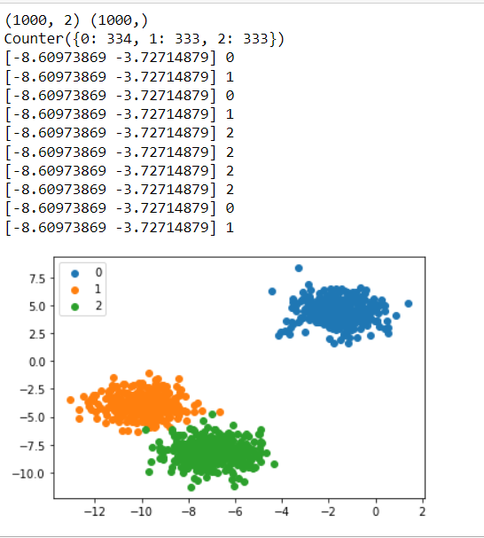

## EX NO: 03

## DATE :

## <p align = 'center'>MULTI-CLASS-CLASSIFICATION</p>
## Aim:
To write a python program to implement the multi class classification algorithm .

## Equipments Required:
1. Hardware – PCs
2. Anaconda – Python 3.7 Installation / Moodle-Code Runner / Google Colab

## Related Theoritical Concept:

In multi-class classification, the neural network has the same number of output nodes as the number of classes. Each output node belongs to some class and outputs a score for that class. Class is a category for example Predicting animal class from an animal image is an example of multi-class classification, where each animal can belong to only one category.


## Algorithm:

Step 1:
1.Import the necessary modules.

Step 2:
2.Frame the dataset using make_blobs.

Step 3:
3.Assign the counter value using the Counter function.

Step 4:
4.Using a for loop, plot the points using scatter function.
## Program:
```
Program to implement the multi class classifier.
Developed by:SOUVIK KUNDU
RegisterNumber: 212221230105

from numpy import where
from collections import Counter
from sklearn.datasets import make_blobs
from matplotlib import pyplot
X, y = make_blobs(n_samples=1000, centers=3, random_state=1)
print(X.shape, y.shape)
counter = Counter(y)
print(counter)
for i in range(10):
    print(X[i], y[i])
for label, _ in counter.items():
	row_ix = where(y == label)[0]
	pyplot.scatter(X[row_ix, 0], X[row_ix, 1], label=str(label))
pyplot.legend()
pyplot.show()
```

## Output:



## Result:
Thus the python program to implement the multi class classification was implemented successfully.
